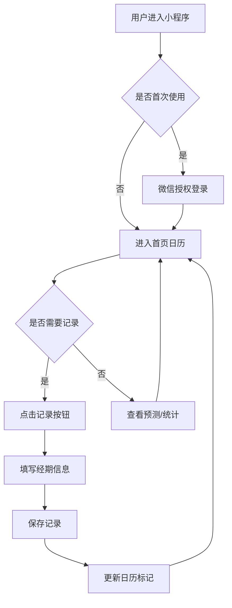

# 经期记录微信小程序 - 产品需求文档 (PRD)

**版本号：** V1.0  
**创建时间：** 2026-04-08  
**产品经理：** 📦 Product Agent  
**状态：** 待评审  
**文档来源：** 参考 pm-skills/pm-prd-writer 标准

---

## 📋 版本记录

| 版本 | 日期 | 修订人 | 修订内容 | 状态 |
|------|------|--------|----------|------|
| V0.1 | 2026-04-06 | Product Agent | 初稿 | 已废弃 |
| V0.2 | 2026-04-08 | Product Agent | 重构版 | 已废弃 |
| V1.0 | 2026-04-08 | Product Agent | 参考 pm-skills 标准重写 | 待评审 |

---

## 一、概述（为什么做）

### 1.1 产品概述及目标

#### 1.1.1 背景介绍

**市场现状：**
- 经期管理 App 市场成熟，但普遍存在广告多、功能臃肿、隐私担忧等问题
- 现有产品（美柚、大姨妈等）用户基数大但体验下降明显
- 微信小程序生态中缺少简洁、专业的经期记录工具

**用户痛点：**
| 痛点 | 描述 | 严重度 |
|------|------|--------|
| 经期不规律 | 难以预测下次经期，经常措手不及 | 🔴 高 |
| 缺乏专业指导 | 不知道症状是否正常，缺乏健康知识 | 🔴 高 |
| 隐私担忧 | 担心生理数据泄露给第三方 | 🔴 高 |
| 广告干扰 | 现有产品广告多，体验差 | 🟡 中 |
| 数据不同步 | 换手机后数据丢失 | 🟡 中 |

#### 1.1.2 产品概述

一款面向女性的**经期记录、预测及健康管理微信小程序**，提供准确的经期预测、个性化健康建议和隐私保护。

**产品 Slogan：** 懂你，更懂你的周期

#### 1.1.3 产品目标

**业务目标：**
| 指标 | 目标值 | 测量周期 |
|------|--------|----------|
| DAU（日活跃用户） | 1 万 + | 上线后 3 个月 |
| 7 日留存率 | > 40% | 上线后 3 个月 |
| 预测准确率 | > 85% | 持续监控 |
| 用户满意度 | > 4.5 星 | 应用商店评分 |

**用户目标：**
- 准确记录经期数据，无需担心数据丢失
- 提前预知下次经期，做好准备
- 了解自身周期规律，管理健康
- 获得专业的健康知识指导

#### 1.1.4 目标用户

| 用户类型 | 年龄段 | 核心需求 | 使用场景 | 优先级 |
|----------|--------|----------|----------|--------|
| **核心用户** | 18-35 岁育龄女性 | 经期记录、预测 | 日常健康管理 | P0 |
| **备孕用户** | 25-40 岁 | 排卵期预测、易孕期提醒 | 备孕期间 | P1 |
| **避孕用户** | 18-30 岁 | 安全期计算、避孕提醒 | 日常避孕 | P1 |
| **健康关注用户** | 20-45 岁 | 症状追踪、健康分析 | 长期健康管理 | P2 |

### 1.2 名词说明

| 名词 | 定义 |
|------|------|
| 周期长度 | 上次经期开始到下次经期开始的天数（平均 28 天） |
| 经期长度 | 经期持续的天数（平均 3-7 天） |
| 排卵期 | 下次经期前 14 天左右的日期 |
| 易孕期 | 排卵日前 5 天至后 4 天，共 10 天 |
| 安全期 | 除月经期和排卵期外的时间（避孕参考，非绝对安全） |
| 流量 | 经期出血量，分为少/中/多三档 |

### 1.3 角色及权限

| 角色 | 权限 | 说明 |
|------|------|------|
| **普通用户** | 记录、查看、预测、统计 | 基础功能 |
| **备孕用户** | 开启备孕模式、查看易孕期 | 需手动开启 |
| **避孕用户** | 开启避孕模式、查看安全期 | 需手动开启 |

### 1.4 文档阅读对象

| 角色 | 关注重点 |
|------|----------|
| 开发团队 | 功能需求、接口定义、数据字典 |
| 测试团队 | 验收标准、异常流程、边界条件 |
| UI 设计师 | 界面交互、全局说明 |
| 项目经理 | 功能清单、版本规划、优先级 |

---

## 二、产品描述（做什么）

### 2.1 产品需求描述

**核心价值：**
1. **准确预测** - 基于 AI 算法的经期预测，准确率>85%
2. **隐私保护** - 数据本地加密存储，可选云端备份
3. **简洁体验** - 无广告、界面清爽、操作便捷
4. **健康指导** - 个性化健康建议和提醒

**功能范围：**
- ✅ 经期记录（开始/结束日期）
- ✅ 症状记录（痛经、头痛等）
- ✅ 流量记录（少/中/多）
- ✅ 情绪记录（好/一般/差）
- ✅ 经期预测（下次经期时间）
- ✅ 排卵期预测（排卵日 + 易孕期）
- ✅ 提醒通知（经期来临前提醒）
- ✅ 数据统计（周期统计、趋势图表）
- ❌ 社区交流（V1.0 不做）
- ❌ 电商导购（V1.0 不做）

### 2.2 产品整体流程

#### 主流程图



#### 核心业务流程

```mermaid
sequenceDiagram
    participant 用户
    participant 小程序
    participant 云端
    participant 微信
    
    用户->>小程序：打开小程序
    小程序->>微信：请求登录授权
    微信-->>小程序：返回用户信息
    小程序->>云端：同步用户数据
    云端-->>小程序：返回历史记录
    小程序-->>用户：展示首页日历
    
    用户->>小程序：记录经期
    小程序->>小程序：验证数据
    小程序->>云端：保存记录
    云端-->>小程序：保存成功
    小程序->>小程序：更新预测
    小程序-->>用户：保存成功提示
```

### 2.3 全局说明

#### 2.3.1 异常处理

| 异常类型 | 处理方式 | 用户提示 |
|----------|----------|----------|
| 网络异常 | 本地存储，网络恢复后同步 | "网络异常，已保存到本地" |
| 数据为空 | 展示引导文案和示例 | "还没有记录哦，开始记录第一条经期吧" |
| 权限不足 | 引导用户授权 | "需要获取您的微信头像和昵称" |
| 服务器错误 | 重试 3 次后提示 | "服务器开小差了，请稍后再试" |

#### 2.3.2 列表规则

| 列表 | 排序规则 | 分页策略 |
|------|----------|----------|
| 经期记录列表 | 按日期倒序 | 每次加载 3 个月 |
| 症状统计列表 | 按出现频率降序 | 全部展示 |
| 健康知识列表 | 按发布时间倒序 | 每次加载 20 条 |

#### 2.3.3 全局交互

| 交互元素 | 规范 |
|----------|------|
| 主色调 | #FF6B8A（粉色） |
| 辅助色 | #FFB6C1（浅粉）、#52C41A（成功）、#FAAD14（警告）、#F5222D（错误） |
| 字体 | 系统默认字体 |
| 按钮高度 | 44px（最小点击区域） |
| 加载状态 | 骨架屏 + Loading 动画 |
| 空状态 | 插画 + 引导文案 |

### 2.4 产品版本规划

| 版本 | 时间 | 核心功能 | 目标 |
|------|------|----------|------|
| **V1.0** | 2026-05-31 | 经期记录、预测、提醒 | MVP 上线 |
| **V1.1** | 2026-06-30 | 备孕/避孕模式、健康知识 | 功能完善 |
| **V1.2** | 2026-07-31 | 体温记录、体重记录 | 健康管理 |
| **V2.0** | 2026-08-31 | 数据导出、PDF 报告 | 专业版 |

### 2.5 产品框架

```
┌─────────────────────────────────────────────────────────────┐
│                      底部 TabBar                             │
│  ┌──────┐  ┌──────┐  ┌──────┐  ┌──────┐  ┌──────┐         │
│  │ 首页 │  │ 记录 │  │  ➕  │  │ 统计 │  │ 我的 │         │
│  └──────┘  └──────┘  └──────┘  └──────┘  └──────┘         │
└─────────────────────────────────────────────────────────────┘
```

### 2.6 功能清单

| 模块 | 功能 | 优先级 | 估时 | 状态 |
|------|------|--------|------|------|
| **首页** | 日历展示 | P0 | 2d | 待开发 |
| | 经期标记 | P0 | 1d | 待开发 |
| | 预测显示 | P0 | 2d | 待开发 |
| | 快捷记录 | P0 | 1d | 待开发 |
| **记录** | 经期记录 | P0 | 2d | 待开发 |
| | 症状记录 | P1 | 1d | 待开发 |
| | 流量记录 | P1 | 1d | 待开发 |
| | 情绪记录 | P1 | 1d | 待开发 |
| **预测** | 经期预测 | P0 | 3d | 待开发 |
| | 排卵期预测 | P1 | 2d | 待开发 |
| | 易孕期提醒 | P1 | 1d | 待开发 |
| **统计** | 周期统计 | P1 | 2d | 待开发 |
| | 趋势图表 | P1 | 3d | 待开发 |
| | 症状分析 | P2 | 2d | 待开发 |
| **我的** | 个人设置 | P1 | 2d | 待开发 |
| | 数据管理 | P1 | 2d | 待开发 |
| | 帮助中心 | P2 | 1d | 待开发 |

---

## 三、功能需求（怎么做）

### 3.1 首页模块

#### 3.1.1 功能描述

首页以日历形式展示用户的经期记录和预测，支持快速查看和记录。

#### 3.1.2 用户故事

| ID | 用户故事 | 优先级 |
|----|----------|--------|
| US001 | 作为用户，我希望在日历上看到我的经期标记，这样我可以一目了然地了解我的周期 | P0 |
| US002 | 作为用户，我希望看到下次经期的预测，这样我可以提前做好准备 | P0 |
| US003 | 作为用户，我希望快速记录今天的经期状态，这样我不需要跳转多个页面 | P0 |

#### 3.1.3 前置条件

- 用户已登录小程序
- 用户已授权获取日历权限（可选）

#### 3.1.4 后置条件

- 日历数据实时更新
- 预测数据根据新记录重新计算

#### 3.1.5 界面及交互

**界面布局：**
```
┌─────────────────────────────────┐
│  ← 2026 年 4 月        📊 ≡     │  ← 导航栏
├─────────────────────────────────┤
│                                 │
│     日 一 二 三 四 五 六         │  ← 星期头
│                                 │
│         1  2  3  4  5  6        │
│      7  8  9 10 11 12 13        │  ← 日历网格
│     14 15 16 17 18 19 20        │
│     21 22 23 24 25 26 27        │
│     28 29 30                    │
│                                 │
├─────────────────────────────────┤
│  📊 周期第 5 天                    │  ← 状态卡片
│  预计还有 3 天结束                 │
│                                 │
├─────────────────────────────────┤
│  [记录今天]      [预测]          │  ← 快捷操作
└─────────────────────────────────┘
```

**交互说明：**
| 元素 | 类型 | 默认值 | 操作 | 反馈 |
|------|------|--------|------|------|
| 月份切换 | 左右箭头 | 当前月份 | 点击切换月份 | 平滑滑动动画 |
| 日期格子 | 点击区域 | - | 点击查看/编辑当天 | 弹出详情卡片 |
| 经期中日期 | 红色圆点 | - | - | - |
| 预测经期 | 粉色圆点 | - | - | - |
| 今天 | 高亮边框 | - | - | - |
| 记录今天 | 按钮 | - | 跳转记录页 | 页面跳转 |
| 预测 | 按钮 | - | 跳转预测页 | 页面跳转 |

#### 3.1.6 业务流程

详见 2.2 产品整体流程

#### 3.1.7 异常/分支流程

| 异常场景 | 处理方式 |
|----------|----------|
| 无历史记录 | 展示引导文案："开始记录第一条经期吧" |
| 网络异常 | 展示本地缓存数据，提示"网络异常" |
| 数据加载失败 | 展示重试按钮，支持手动刷新 |
| 日期超出范围 | 限制前后 10 年，提示"日期超出范围" |

#### 3.1.8 数据字典

**日历数据结构：**
```json
{
  "year": "number",      // 年份
  "month": "number",     // 月份 (1-12)
  "days": [              // 日期数组
    {
      "date": "string",  // 日期字符串 (YYYY-MM-DD)
      "isPeriod": "boolean",  // 是否经期中
      "isPredicted": "boolean", // 是否预测经期
      "isToday": "boolean",  // 是否今天
      "flowLevel": "string", // 流量级别 (light/medium/heavy)
      "symptoms": ["string"] // 症状数组
    }
  ]
}
```

### 3.2 记录模块

#### 3.2.1 功能描述

支持用户记录经期开始/结束日期、流量、症状、情绪等信息。

#### 3.2.2 用户故事

| ID | 用户故事 | 优先级 |
|----|----------|--------|
| US010 | 作为用户，我希望快速记录经期的开始和结束，这样我可以追踪我的周期 | P0 |
| US011 | 作为用户，我希望记录经期的流量，这样我可以了解我的经量变化 | P1 |
| US012 | 作为用户，我希望记录症状，这样我可以追踪我的不适症状 | P1 |
| US013 | 作为用户，我希望记录情绪，这样我可以了解我的情绪波动 | P1 |

#### 3.2.3 前置条件

- 用户已登录

#### 3.2.4 后置条件

- 记录保存到云端和本地
- 首页日历同步更新
- 预测数据重新计算

#### 3.2.5 界面及交互

**记录表单：**
```
┌─────────────────────────────────┐
│  ← 记录今天           ✓ 保存   │
├─────────────────────────────────┤
│                                 │
│  📅 2026 年 4 月 8 日 星期三       │
│                                 │
├─────────────────────────────────┤
│  开始日期 *                      │
│  ┌─────────────────────────┐   │
│  │ 2026-04-01              │   │
│  └─────────────────────────┘   │
│                                 │
│  结束日期                        │
│  ┌─────────────────────────┐   │
│  │ 2026-04-05              │   │
│  └─────────────────────────┘   │
│                                 │
│  流量 *                         │
│  ○ 少   ● 中   ○ 多             │
│                                 │
│  症状（多选）                    │
│  ☑️ 痛经  ☐ 头痛  ☐ 腰酸        │
│  ☐ 情绪波动  ☐ 乳房胀痛  ☐ 疲劳  │
│                                 │
│  情绪                            │
│  😊 好    😐 一般   😞 差        │
│                                 │
│  备注（可选）                    │
│  ┌─────────────────────────┐   │
│  │ 这次经期比较正常...      │   │
│  └─────────────────────────┘   │
│                                 │
├─────────────────────────────────┤
│         [保存记录]               │
└─────────────────────────────────┘
```

**交互说明：**
| 字段 | 类型 | 必填 | 校验规则 | 默认值 |
|------|------|------|----------|--------|
| 开始日期 | 日期选择器 | 是 | 不能晚于今天 | 今天 |
| 结束日期 | 日期选择器 | 否 | 不能早于开始日期 | - |
| 流量 | 单选 | 是 | 必选 | 中 |
| 症状 | 多选 | 否 | 最多选 5 个 | - |
| 情绪 | 单选 | 否 | - | 一般 |
| 备注 | 文本框 | 否 | 最多 200 字 | - |

#### 3.2.6 异常/分支流程

| 异常场景 | 处理方式 |
|----------|----------|
| 结束日期早于开始日期 | 提示"结束日期不能早于开始日期" |
| 网络异常 | 本地保存，提示"网络异常，已保存到本地" |
| 数据验证失败 | 高亮错误字段，提示具体错误信息 |
| 重复记录同一天 | 提示"今天已经记录过了，是否修改？" |

#### 3.2.7 数据字典

**记录数据结构：**
```json
{
  "id": "string",        // 记录 ID
  "userId": "string",    // 用户 ID
  "date": "string",      // 记录日期 (YYYY-MM-DD)
  "startDate": "string", // 经期开始日期
  "endDate": "string",   // 经期结束日期
  "flowLevel": "string", // 流量级别 (light/medium/heavy)
  "symptoms": ["string"],// 症状数组
  "mood": "string",      // 情绪 (bad/normal/good)
  "note": "string",      // 备注
  "createdAt": "number", // 创建时间戳
  "updatedAt": "number"  // 更新时间戳
}
```

---

## 四、非功能需求（注意事项）

### 4.1 安全与合规

| 要求 | 实现方式 | 验收标准 |
|------|----------|----------|
| 数据加密 | 敏感数据 AES-256 加密 | 数据库查看为密文 |
| 传输安全 | 所有请求 HTTPS | 无 HTTP 请求 |
| 隐私保护 | 最小权限原则 | 不收集无关信息 |
| 数据备份 | 微信云存储 | 支持恢复 |
| 用户注销 | 支持删除账号和数据 | 数据彻底清除 |

### 4.2 统计需求（埋点）

| 事件名 | 触发时机 | 属性 |
|--------|----------|------|
| page_view | 页面加载 | page_name, user_id |
| record_create | 创建记录 | record_type, has_symptoms |
| record_update | 修改记录 | record_type |
| prediction_view | 查看预测 | prediction_type |
| reminder_click | 点击提醒 | reminder_type |

### 4.3 性能需求

| 指标 | 要求 | 测量方式 |
|------|------|----------|
| 页面加载时间 | < 2 秒 | 冷启动测试 |
| 预测响应时间 | < 1 秒 | API 调用测试 |
| 数据同步时间 | < 5 秒 | 云端同步测试 |
| 崩溃率 | < 0.1% | 线上监控 |

### 4.4 数据库设计

**用户表 (users)：**
| 字段 | 类型 | 必填 | 说明 |
|------|------|------|------|
| id | string | 是 | 用户 ID |
| openid | string | 是 | 微信 openid |
| nickname | string | 否 | 昵称 |
| avatar | string | 否 | 头像 URL |
| createdAt | number | 是 | 创建时间 |

**记录表 (records)：**
| 字段 | 类型 | 必填 | 说明 |
|------|------|------|------|
| id | string | 是 | 记录 ID |
| userId | string | 是 | 用户 ID |
| date | string | 是 | 记录日期 |
| flowLevel | string | 是 | 流量级别 |
| symptoms | array | 否 | 症状数组 |
| mood | string | 否 | 情绪 |
| note | string | 否 | 备注 |

### 4.5 系统集成

| 系统 | 接口 | 方向 | 说明 |
|------|------|------|------|
| 微信登录 | auth.code2Session | 调用 | 用户登录 |
| 微信云存储 | cloud.callFunction | 调用 | 数据备份 |
| 订阅消息 | subscribeMessage.send | 调用 | 经期提醒 |

---

## 五、附录

### 5.1 验收标准与测试要点

#### 首页模块验收标准

| ID | 验收条件 | 测试方法 | 预期结果 |
|----|----------|----------|----------|
| AC001 | 日历正确显示当前月份 | 打开首页 | 显示当前月份日历 |
| AC002 | 经期中日期显示红色标记 | 查看有记录的日期 | 红色圆点显示 |
| AC003 | 预测经期显示粉色标记 | 查看预测日期 | 粉色圆点显示 |
| AC004 | 今天日期高亮显示 | 查看今天 | 高亮边框 |
| AC005 | 可以切换月份 | 点击左右箭头 | 月份切换成功 |

#### 记录模块验收标准

| ID | 验收条件 | 测试方法 | 预期结果 |
|----|----------|----------|----------|
| AC010 | 可以创建新记录 | 填写表单并保存 | 保存成功 |
| AC011 | 结束日期不能早于开始日期 | 选择早于开始的日期 | 提示错误 |
| AC012 | 流量必须选择 | 不选择流量 | 提示必填 |
| AC013 | 症状最多选 5 个 | 选择 6 个症状 | 第 6 个无法选择 |
| AC014 | 备注最多 200 字 | 输入 201 字 | 无法输入 |

### 5.2 待确认项清单

#### 必须确认（阻塞开发）

1. **[待确认]** 经期预测算法使用哪种？（周期平均法/加权平均法/AI 算法）→ 见 3.1.5 节
2. **[待确认]** 提醒时间默认设置为几点？→ 见 4.5 节
3. **[待确认]** 是否需要支持多周期记录（如双胞胎周期）？→ 见 1.3 节

#### 建议确认（影响完整度）

4. **[待确认]** 是否需要支持导出 PDF 报告？→ 见 2.6 功能清单
5. **[待确认]** 健康知识内容来源？（自建/第三方 API）→ 见 4.5 节

#### 可后续补充

6. **[待确认]** 灰度发布策略？→ 见 4.3 节
7. **[待确认]** 客服接入方式？→ 见 5.1 节

---

**文档版本：** V1.0  
**最后更新：** 2026-04-08  
**下次评审：** 2026-04-12  
**参考标准：** pm-skills/pm-prd-writer
